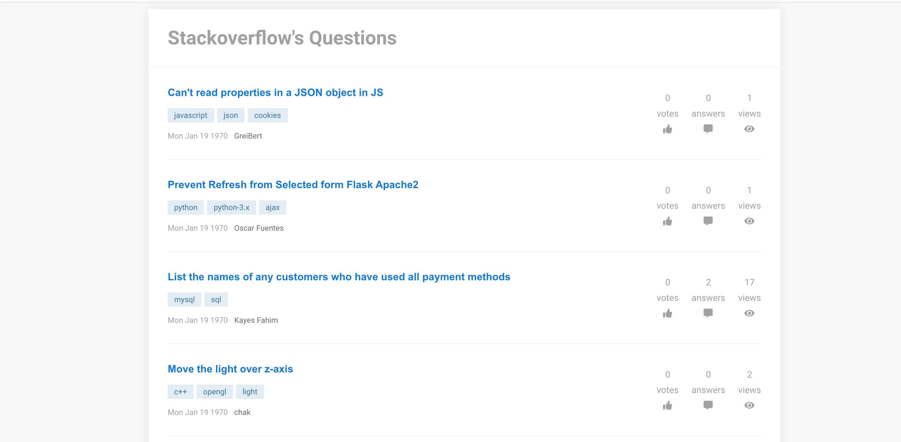
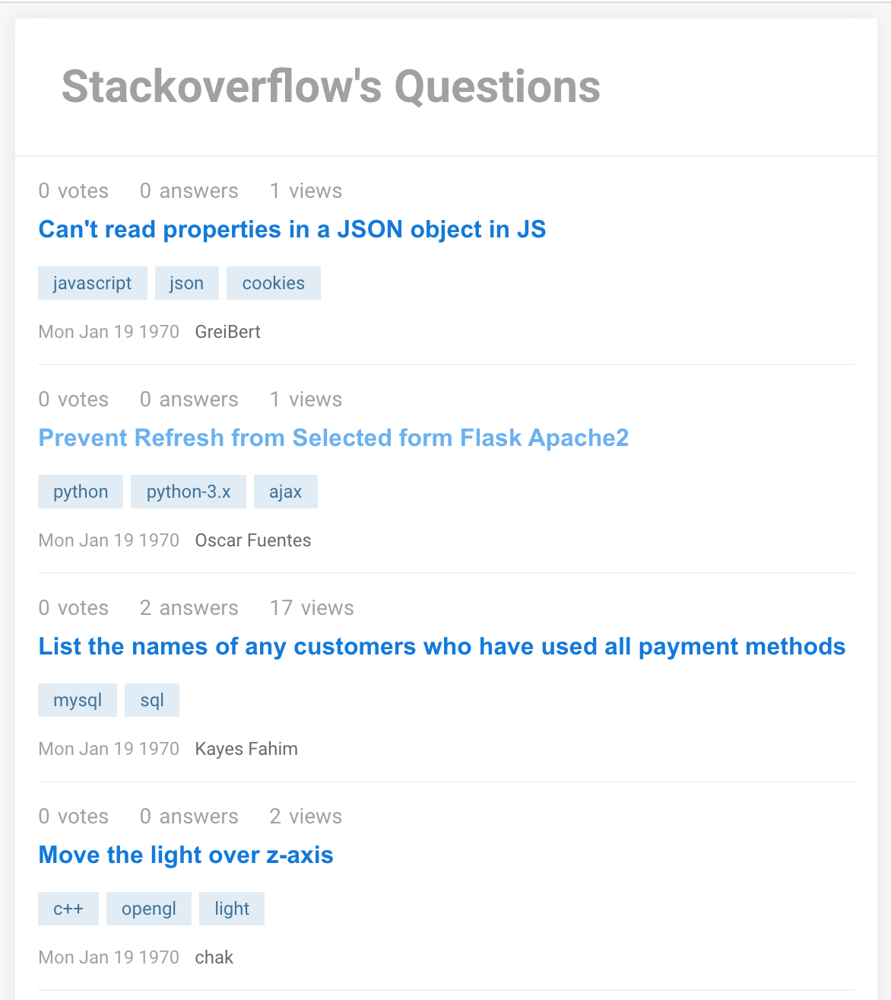

# Stackoverflow's Questions - by Mihir Suchak

- Project: _Stackoverflow's Questions 
- Language/Frameworks: _Typescript(with React) + SCSS_

#### Desktop View:

#### Mobile View:


Check Live Here [Link](https://iqm-practical-test.vercel.app/)

## Howdy! 👋

Hey there, this is Mihir Suchak.
## Features Implemented as MVP

- Error message will show in the alert box for any kind of errors.
- I have used DOMPurify to sanitized content before using it in the app.
- To keep code organized and error-free I did setup locally eslint and prettier.
- Implemented smooth Skelton animation loader.
- With a click on a question, a modal will appear and their user can find the body of that particular question along with a redirection link for a Stackoverflow in a text of a `Go to Question`.
- Clicking on the tagged user will be redirected to all the questions related to that particular tag in a Stackoverflow.

## Possible Enhancements

- [UI] There is always scope for improvements of design.
- [TECH] We can use more utility classes using bootstrap or making our own with a tailwind.
- [TECH] Instead of normal scss we can use the .modules pattern for local components.
- [TECH] We can use a custom error boundary component.
- [TECH] In the real project we can use more detailed meta tags roboto.txt and sitemap to improve SEO.

## Setup & Development

### Prerequisite

- Make sure you have `node` installed -- recommended `15.6.0`.
- Once you have a `node` installed, run `npm install` in this repo to get your dependencies.

In the project directory, you can run:
### `npm start`

Runs the app in the development mode.<br />
Open [http://localhost:3000](http://localhost:3000) to view it in the browser.

The page will reload if you make edits.<br />
You will also see any lint errors in the console.

### `npm run build`

Builds the app for production to the `build` folder.<br />
It correctly bundles React in production mode and optimizes the build for the best performance.

The build is minified and the filenames include the hashes.<br />
Your app is ready to be deployed!

See the section about [deployment](https://facebook.github.io/create-react-app/docs/deployment) for more information.

## Technical Details

### Src Structure / Components

```
src
├── App.tsx
├── reportWebVitals.ts
├── assets
|   └── scss
|       ├── global.scss
|       └── helper
|           ├── _color.scss
|           ├── _reset.scss
├── components
|   └── QuestionsComponents
|       └── QuestionModal
|           ├── QuestionModal.tsx
|           ├── QuestionModal.scss
|       └── QuestionsList
|           ├── QuestionsList.tsx
|           ├── QuestionsList.scss
|   └── Shared
|       └── Alert
|           ├── Alert.tsx
|           ├── Alert.scss
|       └── Button
|           ├── Button.tsx
|           ├── Button.scss
|       └── Chip
|           ├── Chip.tsx
|           ├── Chip.scss
|       └── Loading
|           ├── Loading.tsx
|           ├── Loading.scss
|       └── Modal
|           ├── Modal.tsx
|           ├── Modal.scss
|       └── ScrollTop
|           ├── ScrollTop.tsx
|           ├── ScrollTop.scss
├── pages
|   └── Questions
|       ├── Questions.tsx
|   └── NotFound
|       ├── NotFound.tsx
|       ├── NotFound.scss

├── utils
|   └── config
|       ├── apiEndPoints.ts
|   └── helperFunctions
|       ├── index.ts
|   └── types
|       ├── index.ts
|   └── useHooks
|       ├── useQuestionsList.ts
public
├── index.html
```

### Description / Data Flow / Approach

- This project was bootstrapped with [Create React App](https://github.com/facebook/create-react-app). Reason: wanted to move quickly since this structure will give me the minimum things I'd need to create an MVP.
- Used scss variables for colors so anytime it can be changed from the one place and it'll reflect at respective places.
- Implemented custom component so we can reuse it anywhere like Button, Modal, Alert, etc.

Thank you!
